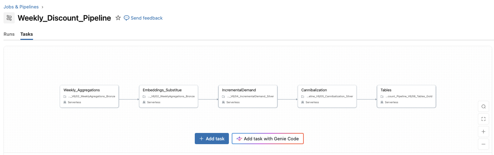

## Flagship Retail Causal Inference Relationship: Do discounted items actually sell more?

 **The question:** In apparel retail, does marking an article down cause incremental demand? And how much of that lift is simply cannibalized from similar articles that were never discounted?

This is an end-to-end pipeline that ingests real retail transaction data in weekly batches (run as a Databricks Job, with a hypothetical Airflow DAG for scheduling), identifies discounted articles and similar articles for comparison, estimates treatment effects and updates aggregated metrics for a weekly Databricks dashboard.

The pipeline answers two related questions:
1. **Incremental demand:** How many additional units are associated with discounting an article?
2. **Cannibalization:** How much of that increase is offset by reduced sales of similar, non-discounted articles?

The full methodology, table definitions and limitations are in **[METHODS.md](METHODS.md)**.

## Why a Causal Design

**Naive price analysis fails.** Articles are often discounted because they are already selling poorly, so lower prices can be associated with lower sales even when discounting increases demand. A forecast can predict how many units an article will sell, but not how sales would have differed without the discount.

**Cannibalization matters.** A customer who buys the discounted article may otherwise have bought a similar, non-discounted one, so treating one article can change another article's outcome. The pipeline therefore separates:
* **Article-level demand:** the estimated incremental effect on the discounted article
* **Substitute-level demand:** the change in sales among similar, non-discounted articles
* **Net category demand:** incremental sales minus estimated cannibalized sales

## Approach

1. **Find similar articles (03).** Product attributes are encoded with a sentence-transformer (all-MiniLM-L6-v2, PyTorch) and blended with customer-behavior embeddings (SVD of pre-treatment purchases). Exact cosine search ranks the 30 most similar articles for every article. This step never sees discount status or treatment-week sales.
2. **Estimate incremental demand (04).** Using the latest 5 weeks (4 before, 1 discount week), an article is *discounted* if its week-5 price is at least 5% below its pre-period price. The 3 closest eligible, non-discounted articles of each discounted article are *exposed* and kept out of the controls. Each discounted article is matched to 5 *clean controls* and a weighted difference-in-differences (DiD) regression estimates the effect.
3. **Estimate cannibalization (05).** The same DiD compares exposed articles with controls matched from the same clean-control pool.
4. **Publish gold tables (06).** Gross, cannibalized and net units, confidence intervals, a category rollup and a pipeline-health log feed the dashboard.
## Repository Structure

```text
├── README.md                               # Project overview
├── METHODS.md                              # Causal design, table definitions, limitations
├── Weeks_Segmented.ipynb                   # Splits the H&M data into a master table + 4 weekly files
├── notebooks/
│   ├── 01_Uploads_Bronze.ipynb             # Loads H&M articles and master transactions (bronze)
│   ├── 02_WeeklyAgregations_Bronze.ipynb   # Appends the newest weekly CSV to the master table
│   ├── 03_Embeddings_Substitute.ipynb      # Text + behavior embeddings, top-30 similar articles
│   ├── 04_IncrementalDemand_Silver.ipynb   # Treatment, exposure, matching, demand DiD
│   ├── 05_Cannibalization_Silver.ipynb     # Exposed-article DiD, cannibalized units
│   └── 06_Tables_Gold.ipynb                # KPIs, category rollup, dashboard tables, pipeline health
├── dags/
│   └── hypothetical_hnm_DAG.py             # Hypothetical weekly Airflow DAG (02 → 06)
├── results/
│   └── Week_35_36_Results.md               # Dashboard analysis & result discussion 
├── img/                                    # Databricks Jobs pipeline & dashboard screenshot                   
└── data/                                   # Segmented week 35 - 38 csv files       
```
## Data

**H&M Personalized Fashion Recommendations:** roughly 31M transactions over two years, 1.37M customers and 105K articles, with a transaction-level price, a sales channel flag and article text descriptions.

To mimic a business's weekly sales feed, the dataset is split into a master table (2018-09-20 to 2020-08-21) and four weekly files (2020-08-24 to 2020-09-20). 
The demonstrated results come from two runs of week 35 & 36. Weeks 37 & 38 are provided for demonstration.

## Pipeline

```text
H&M Transactions
       │
       ▼
02  Weekly Ingestion (bronze)
       │
       ▼
03  Embeddings and Similar Articles        outcome-blind: attributes + pre-treatment purchases only
       │   text embeddings + customer behavior (SVD)
       ▼
04  Incremental Demand
       │   identify discounted articles → exposed substitutes → clean controls → matched DiD
       ├──────────────────────────┐
       ▼                          ▼
 Incremental Demand        05  Cannibalization
                           (exposed articles vs controls matched
                            from the same clean-control pool)
       │                          │
       └──────────┬───────────────┘
                  ▼
06  Gold Tables (net effect, category rollup, KPIs, health)
                  │
                  ▼
            Weekly Dashboard
```

| Notebook | Role | Schema |
|---|---|---|
| 01 Uploads | Loads the H&M articles and master transactions from HuggingFace | `workspace.default` |
| 02 Ingestion | Appends the newest weekly CSV to the master transactions table | `workspace.default` |
| 03 Embeddings | Text and behavior embeddings, top-30 similar articles | `workspace.hnm_discount` |
| 04 Incremental demand | Treatment, exposure, matching, demand DiD | `workspace.hnm_discount_silver` |
| 05 Cannibalization | Exposed-article DiD, cannibalized units | `workspace.hnm_discount_silver` |
| 06 Gold tables | KPIs, category rollup, dashboard tables, pipeline health | `workspace.hnm_discount_gold` |

Inputs, outputs and settings for each notebook are in [METHODS.md](METHODS.md#pipeline-layout-and-settings).

## Dashboard

The dashboard reads only the gold tables written by notebook 06 and shows:
* **Gross incremental units:** DiD effect per discounted article × number of matched discounted articles
* **Cannibalized units:** lost units among exposed articles (each counted once)
* **Net incremental units:** gross − cannibalized
* **% of lift cannibalized:** shown only when gross is positive
* **95% confidence intervals** and the number of discounted and exposed articles
* **`kpi_status`:** `OK`, or `NO_POSITIVE_GROSS_EFFECT` / `PRE_TREND_WARNING`

It also includes a category rollup by product group and garment group (flagged when more than 50% of lift is cannibalized), an article drill-down, parallel-trends charts and a pipeline-health log with one row per run. `lift_units` in the drill-down is a descriptive before/after change; the causal per-article value is `adj_lift_units`.

## Orchestration

Actual notebook orchestration was conducted through Databricks Jobs:


Since REST API access and job-execution clusters are not available on the Databricks Community (Free) Edition, a hypothetical Airflow DAG (`hypothetical_hnm_DAG`) is provided. It runs weekly on Monday 06:00, or when a new weekly CSV in `/Volumes/workspace/default/hnm_weekly_upload/` and runs the notebooks in order: 02 → 03 → 04 → 05 → 06.

Data-quality checks are assertions inside the notebooks. If one fails, that task fails and the later tasks do not run, so a bad result is not published.

## Limitations

* **Discounted articles may already be in decline**, so a negative or wrong-signed estimate is possible when no matched control shares that decline.
* **Exposure is defined by similarity, not observed switching**, so articles outside the top 3 could also lose sales while being used as controls.
* **Single post-period:** one discount week against a 4-week average is exposed to week-specific noise.

The full list is in [METHODS.md](METHODS.md#known-simplifications).

## Key Takeaway

The project separates incremental demand from sales substitution. A markdown can increase sales of the discounted article without increasing total demand if customers simply switch from similar products. By combining Difference-in-Differences with product similarity and customer behavior, the pipeline provides a framework for estimating both effects and monitoring them through a weekly dashboard.

## Tech stack
 Python · PySpark · Databricks · PyTorch · sentence-transformers · scikit-learn (TruncatedSVD) · statsmodels · Databricks Dashboards · SQL · Delta Lake · Unity Catalog
