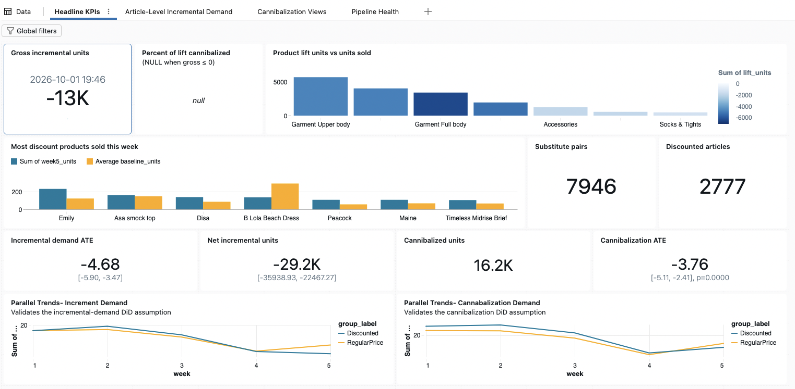
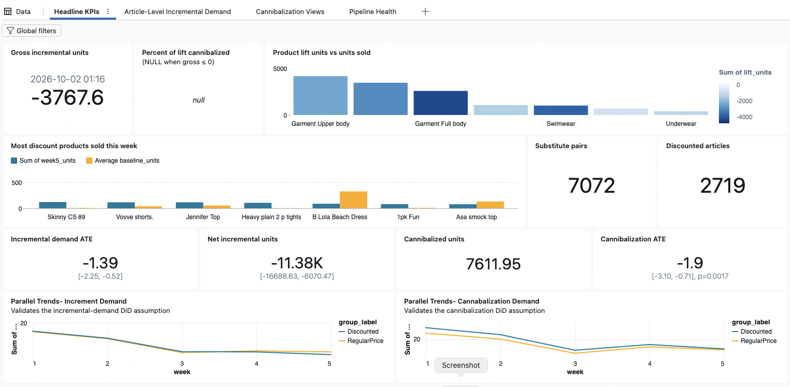
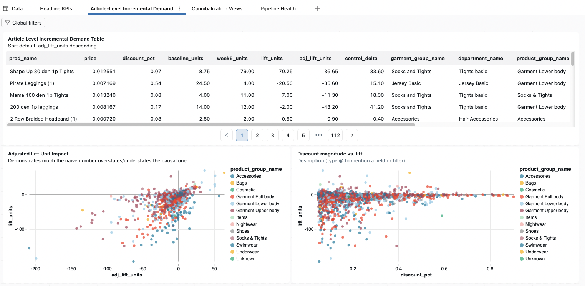
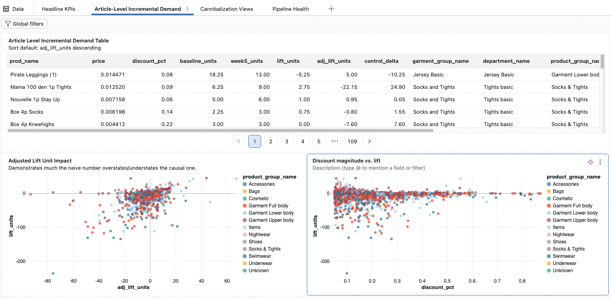
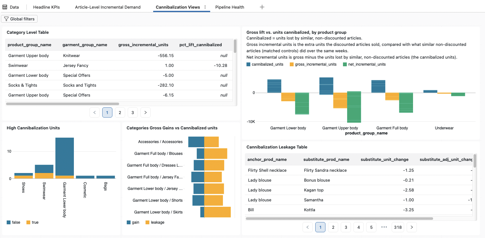
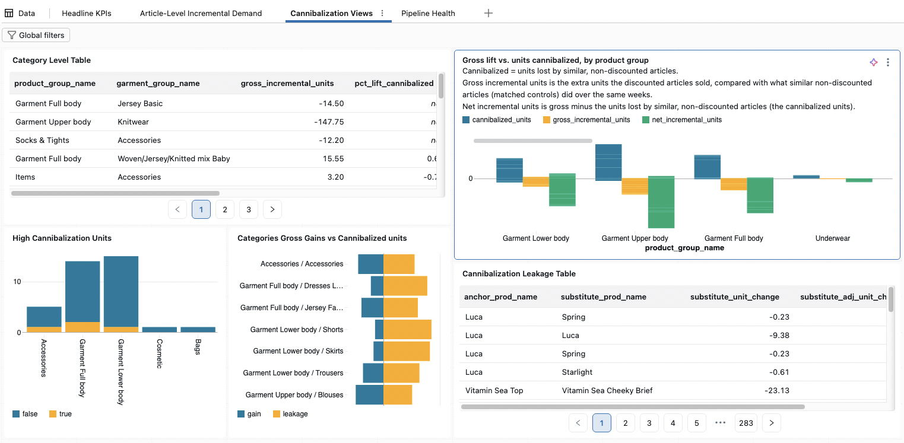
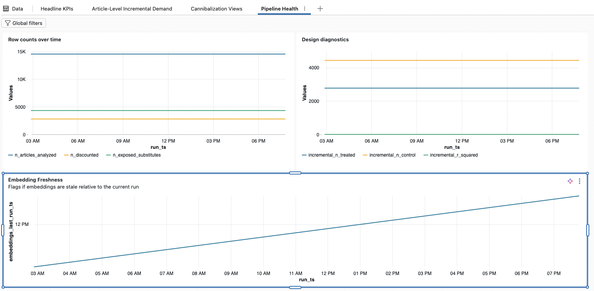
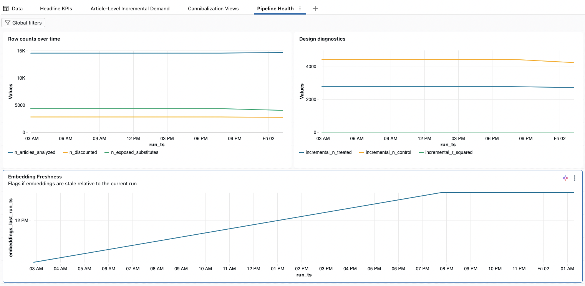

# Discount Causal Inference: Dashboard Results (Weeks 35–36)

## Summary

Neither dashboard run shows discounts adding demand. In the week-35 run, discounted articles sold 4.68 fewer units each than their matched controls (95% CI −5.90 to −3.47) and their similar non-discounted articles lost 3.76 units each. In the week-36 run both effects shrank but stayed negative and significant: −1.39 and −1.90 units.

Net, discounted and exposed articles sold about 29,200 fewer units than the controls imply in week 35 and about 11,400 fewer in week 36. Pre-period trends were parallel, yet the pattern fits end-of-summer clearance better than a real negative effect of discounting.

The screenshots come from two pipeline runs, one per weekly upload; the second moved the 5-week window forward by one week.

|  | Week-35 run | Week-36 run |
| --- | --- | --- |
| Run time (dashboard) | 2026-10-01 19:46 | 2026-10-02 01:16 |
| Treatment week | 2020-08-24 to 2020-08-30 | 2020-08-31 to 2020-09-06 |
| Pre-period weeks starting | 2020-07-27 to 2020-08-17 | 2020-08-03 to 2020-08-24 |
| Discounted articles (matched) | 2,777 | 2,719 |
| Discounted–exposed pairs | 7,946 | 7,072 |
| Embeddings used (notebook 03 run) | 2026-10-01 19:37 | 2026-10-01 19:37 (reused) |

An earlier run at 02:54 on 1 Oct produced the same week-35 numbers. The week-36 dates follow from the parallel-trends charts: the short week of 2020-08-17 shows as a dip in week 4 of the first run and week 3 of the second.

## Headline KPIs

Every headline estimate is negative in both runs and every confidence interval excludes zero.

| Metric | Week 35 | Week 36 |
| --- | --- | --- |
| Incremental demand ATE (units per discounted article) | −4.68 \[−5.90, −3.47\] | −1.39 \[−2.25, −0.52\] |
| Gross incremental units | −13,004.5 | −3,767.6 |
| Cannibalization ATE (units per exposed article) | −3.76 \[−5.11, −2.41\], p < 0.0001 | −1.90 \[−3.10, −0.71\], p = 0.0017 |
| Cannibalized units | 16,198.6 | 7,612.0 |
| Net incremental units | −29,203.1 \[−35,938.9, −22,467.3\] | −11,379.6 \[−16,688.6, −6,070.5\] |
| % of lift cannibalized | blank (gross ≤ 0) | blank (gross ≤ 0) |

Brackets are 95% confidence intervals. Because gross is negative, the cannibalized share is blank and `kpi_status` reports `NO_POSITIVE_GROSS_EFFECT`.

Garment Full body carries the most negative lift in both runs (the darkest bar in the lift chart). The B Lola Beach Dress is among the best-selling discounted products, yet its week-5 units sit far below its baseline in both runs: a summer item selling past its peak.

## Parallel trends

Before the discount week, treated and control groups moved together, so the DiD's key assumption holds as far as it can be checked. In the week-35 run, the log-scale gap between groups stayed within 0.023 of its pre-period average in weeks 1–4 for both estimates, far under the 0.15 warning level. In week 5 it opened to −0.224 for discounted articles and −0.117 for exposed articles.

In the week-36 run, the demand lines nearly overlap in weeks 1–4 and the discounted line ends slightly lower in week 5. The exposed group sits a little above its controls throughout and the gap narrows in week 5. The dashboard does not show the week-36 pre-gap values.

Both runs show a dip shared by every group: week 4 in the first run, week 3 in the second. That is the week of 2020-08-17, which has no Saturday or Sunday because the master table ends on Friday 2020-08-21 and the weekly files start on Monday 2020-08-24. It is a data gap, not a sales drop and it hits both groups alike.

The pre-period fit is partly built in, because matching already penalises differences in pre-period trend. A clean pre-trend shows the matching worked; it cannot rule out a shock that starts in the treatment week itself.

## Article-level demand

Most discounted articles sold less than their own baseline and less than their matched controls and deeper discounts did not bring larger lifts. The table covers 2,777 matched discounted articles in week 35 and 2,719 in week 36.

- **Naive vs adjusted lift.** Most points in the lift scatter sit in the lower-left quadrant: a negative before/after change (`lift_units`) and a negative change relative to controls (`adj_lift_units`). Adjusted lift spans about −200 to +60 units in week 35 and about −80 to +60 in week 36, in line with the smaller ATE.
- **Controls can turn a gain into a smaller gain.** Shape Up 30 den 1p Tights rose from an 8.75-unit baseline to 79 units in week 35 (+70.25), but its matched controls rose 33.60 as well, so its adjusted lift is +36.65. Hosiery controls rose broadly (+18.30 for Mama 100 den 1p Tights, +41.20 for 200 den 1p leggings), consistent with tights season starting in late August.
- **Or a loss into a larger loss.** Pirate Leggings (1), 54% off, fell from 24.50 to 4 units while their controls rose 15.10, for an adjusted lift of −35.60.
- **No dose–response.** Articles discounted 40–90% cluster near zero lift, while the largest drops come at 5–35% discounts. Deep markdowns likely go to low-volume clearance stock with little left to lose; the average-price discount measure can also overstate depth when the sales-channel mix shifts.

## Cannibalization

Exposed articles lost sales in both runs: 16,198.6 units in week 35 and 7,612.0 in week 36. Among the product groups on the gross-vs-cannibalized chart, the three garment groups carry the largest losses and Garment Upper body has the most negative net, about −10,000 units in week 35.

- **Category flags rest on tiny denominators.** The high-cannibalization flag fires only where a category's gross is positive and those gross values are small. Swimwear / Jersey Fancy, for example, has gross of 1.00 unit and a cannibalized share of −10.28 in week 35. Only one or two rows are flagged in each of Shoes, Swimwear and Garment Lower body in week 35 and Accessories, Garment Full body and Garment Lower body in week 36.
- **Some pairs are true substitutes.** Luca → Luca (raw change −9.38 units) pairs two articles with the same product name, most likely colour variants. Lady blouse → Bonus blouse, Kagan top and Samantha are plausible alternatives with small losses (−0.21 to −2.58 units).
- **Some pairs are complements.** Vitamin Sea Top → Vitamin Sea Cheeky Brief (−23.13 units) is a bikini top and its matching brief. The behaviour embedding pairs them because the same customers buy both, so their joint drop in early September more likely reflects swimwear going out of season than one article taking sales from the other.

## Pipeline health

The log shows three runs with stable sample sizes and one gap: the week-36 run reused the previous run's embeddings.

- **Row counts.** The two week-35 runs (02:54 and 19:46 on 1 Oct) match exactly: 14,519 articles analysed, 2,777 discounted, 4,309 exposed. In the week-36 run, analysed articles rise slightly while discounted and exposed counts fall, exposed to roughly 4,000.
- **Design diagnostics.** Matched controls fall from 4,440 to roughly 4,250. R² (0.025 in week 35) shares an axis with counts in the thousands, so it reads as zero; a low R² is expected, since the DiD regression only separates group and period means.
- **Embedding freshness.** The embedding timestamp rises between the first two runs, then stays at 19:37 for the week-36 run, so notebook 03 was not rerun. This causes no leakage, because its behavior cutoff (2020-08-24) is still before the week-36 treatment week. But purchases from the week of 2020-08-24 are missing from the behavior embeddings and the chart shows this only as a flat line.

## What the results mean

At face value, discounting cost about 29,200 units in week 35 and 11,400 in week 36. The likelier reading is that the estimates measure which articles get discounted at the end of summer, not what a discount does.

1. **Selection into discount.** Late August to early September is end of season, so the marked-down articles are likely mostly stock being cleared. Their demand falls faster in week 5 than their matched controls' and a four-week pre-trend cannot foresee that drop. Parallel pre-trends and a negative effect can both hold.
2. **The exposed group inherits that selection.** Exposed articles are chosen for being similar to discounted ones, so they share their season and category. Part of the measured cannibalization is likely the same seasonal decline and subtracting it from an already negative gross counts that decline twice.
3. **The examples point the same way.** The steepest losses sit in Garment Full body, a beach dress and a bikini set, while hosiery controls were rising.

The effects also shrink from week 35 to week 36, by 70% for demand (−4.68 to −1.39) and about half for cannibalization (−3.76 to −1.90). With one post-week per run, more weeks are needed to tell whether that is a trend or noise.

The pipeline itself behaves as designed: per-article effects sum to the headline figures, the category rollup adds up and the intervals are consistent. Turning the estimates into a causal answer needs a seasonal comparison, such as matching within the same product type or using the same weeks of 2019, which the master table covers.

